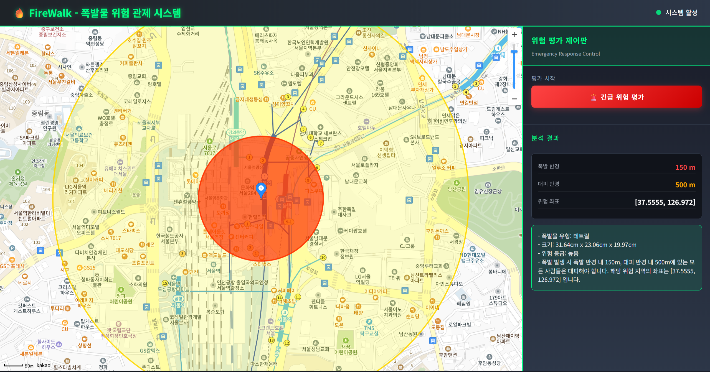

# UWC 2025 AI & 무인이동체 퓨처 해커톤 소스 코드_FireWalk

**FireWalk**는 AI 비전 기술, 무인이동 로봇(UGV), 실시간 관제 시스템을 통합하여  
폭발물 의심 물체를 자동으로 식별·분석하고 위험을 평가하는 지능형 대응 시스템입니다.  
지하철, 공항, 군사시설 등 주요 인프라에서의 **신속한 초기 대응**을 목표로 합니다.


## [대시보드](http://localhost:8000/explosive_form?)



## Getting Started

```bash
# 필수 패키지 설치
pip install -r requirements.txt

# 서버 실행
python main.py
```


## 🔍 주요 기능

- 🎯 [Yolo](https://github.com/ultralytics/ultralytics)를 이용한 **의심 물체 인식 및 분할**
- 📏 **폭발물 크기 추정** (하드코딩 값 or ToF 센서 기반 입력 지원)
- 🧠 **OpenAI API 연동**으로 **피해 반경 추정 및 대피 가이드 자동 생성**
- 🧭 **웹 대시보드**를 통한 위험지역 시각화 및 알림 메시지 출력
- ⚙️ **모듈화 구조**로 센서/AI/관제 모듈 손쉽게 교체 가능

---

## 💡 운영 시나리오

1. 시민 신고 접수
2. 무인이동체 자동 출동 및 현장 촬영
3. AI가 물체의 크기 및 성분 추정
4. GPT 분석 결과를 기반으로 피해 반경 및 대피 가이드 생성
5. 관제 대시보드에 실시간 표시 및 처리반 전송

---

## ⚙️ 기술 스택

| 구성 요소           | 사용 기술                   |
| ------------------- | --------------------------- |
| 백엔드 서버         | Python, FastAPI, OpenAI API |
| 객체 인식           | Yolo                        |
| 크기 추정           | RealSense                   |
| 프론트엔드 대시보드 | HTML + JS                   |
| 지도 연동           | Kakao 지도 API              |
